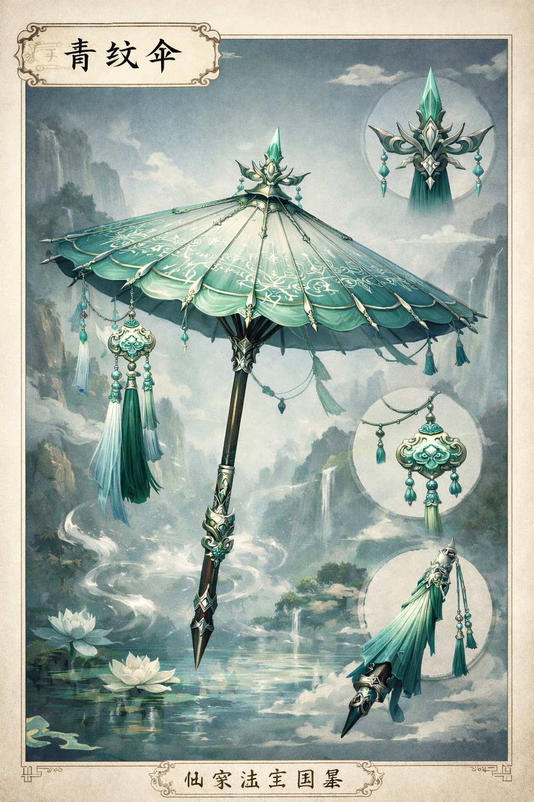
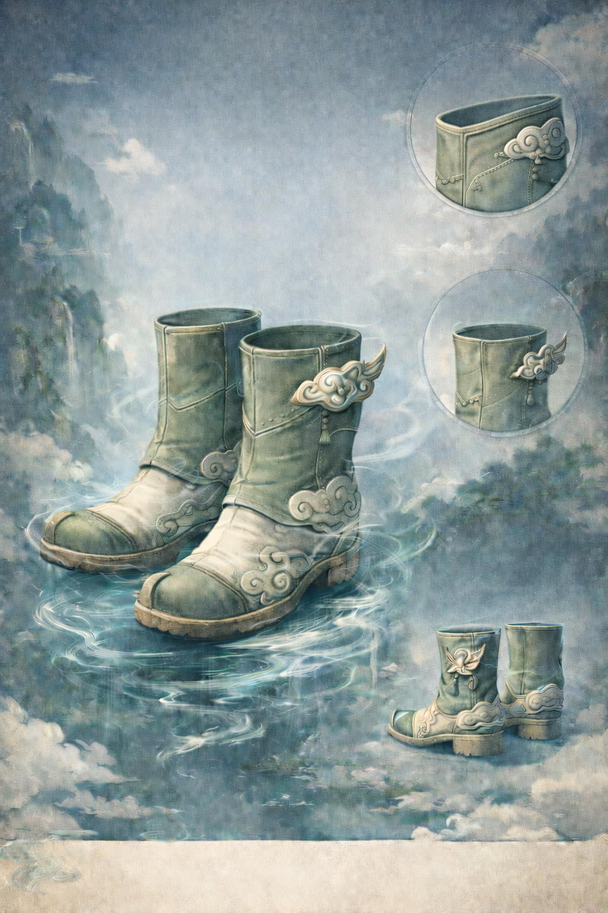

# 筑基期法宝

## 目录
- [青纹伞](#qingwensan)
- [行云靴](#xingyunxue)

本文件收录适合筑基阶段修士持有与使用的器物型宝物。  
这类法宝通常重实用、重护道，与凡间器具仍保留一定联系，不以高深道意取胜，而以用途明确、祭炼门槛适中、便于长期持有为特点。

## 青纹伞

### 名称
青纹伞

### 基本类型
器物型宝物

### 核心作用
以护身为主，可遮挡低阶术法、飞矢与碎石，也可略作蔽息、避风雨与短时遮掩行迹之用。

### 特殊属性
无

### 大致品级
黄阶上品

### 条目资产目录
`./assets/筑基期法宝/`

### 适配对象
更适合筑基阶段、灵力较稳、行事谨慎的修士；尤其适合常在山野、城镇、江湖之间行走，需要兼顾护身与日常掩饰的人。

### 限制与代价
正面防护能力有限，长于“挡”而不长于“硬抗”。  
面对持续轰击、重型攻伐法器或高出自身层次太多的术法时，容易灵光衰竭。  
若长期以蛮力强催，也会损伤伞骨与伞面灵纹。

### 来历或背景
青纹伞是筑基修士中较常见的一类护身法器，其原型与凡间油伞相近，只是在伞骨、伞面与收束结构上经过祭炼，并绘入基础灵纹。  
它不算大器，却因祭炼门槛不高、用途明确、平日不显眼，而长期流行于初入道门之人、外出历练弟子与散修之间。

### 当前状态
完整

### 当前归属
暂留空

### 别称
青骨伞、避风伞

### 外观特征
伞骨细长，伞柄多为青竹、乌木或轻灵木制成。  
伞面常见青灰、淡墨、旧竹色，合伞时与凡间长伞差别不大；张开后，伞面内侧可见浅青色灵纹沿骨延展，如水波细裂。

### 概念图说明
当前概念图突出的是“低调实用的护身法器”气质。  
整体形制接近凡间长伞，但伞骨、伞面与灵纹的细部更显祭炼痕迹，符合筑基阶段常用护道器物的定位。

### 认主情况
可认主，但认主深度通常不高。  
多数筑基修士只将其祭炼为常用护身器，而不会发展到本命层次。

### 温养情况
经日常祭炼与温养后，伞面灵光会更稳，开合更快，对风雨、烟尘、流矢与低阶术法的拦截效果也会更好。  
若温养得当，青纹伞往往比同层次的粗炼护身法器更耐久。

### 与组织或传承的关系
部分宗门会将其作为外门弟子、巡山弟子、执役弟子的常见护身法器之一。  
也有世家会按本家纹样稍作改制，作为低阶子弟出行所用。

### 特殊使用条件
无明显特殊条件。  
只需完成基础祭炼，筑基修士一般即可正常使用。

### 已知弱点 / 克制方式
惧重击、惧持续强攻。  
面对专破护身灵光、专灼伞面灵纹、或直接绕开正面遮护的手段时，效果会明显下降。  
若被近身强攻，青纹伞的优势也会迅速缩小。

### 衍生影响
青纹伞的存在会让持有者更偏向稳守、借势、周旋，而非正面硬拼。  
在低阶修士群体中，它常被视为“能保一命”的实用法器，而非用来一锤定音的胜负手。

### 关键变化记录
暂留空

## 行云靴

### 名称
行云靴

### 基本类型
器物型宝物

### 核心作用
以遁行与轻身为主，可提升短途奔行、纵跃、翻越障碍与踏水借力的能力，也可在危急时短暂爆发速度，用于脱身与追赶。

### 特殊属性
无

### 大致品级
黄阶中品

### 条目资产目录
`./assets/筑基期法宝/`

### 适配对象
更适合筑基阶段需要频繁赶路、巡山、探查、历练的修士；也适合身法较灵活、斗法风格偏机动与游走的人。

### 限制与代价
长于短途机动，不长于长时间高速飞遁。  
若长时间持续催动，容易消耗灵力并加重双腿负担。  
在泥沼、禁空、重压、强拘束环境中，效果会明显下降。

### 来历或背景
行云靴的原型与凡间轻靴、快靴相近，是筑基修士中很实用的一类遁行法器。  
它不像高阶飞遁法宝那样动辄横空远游，而是更贴近初入道门修士的现实需求：赶路、逃命、翻山、越水、追索与撤离。

### 当前状态
完整

### 当前归属
暂留空

### 别称
踏云靴、轻云履

### 外观特征
靴身通常较轻，多用韧性较好的灵皮、轻木纤维或柔韧丝材祭炼而成。  
外表不甚张扬，颜色多为青黑、灰白、墨青；靴侧或靴底可见细密云纹、风纹或淡银色灵线。

### 概念图说明
当前概念图强调的是“轻、快、稳”的遁行法器观感。  
靴形收束利落，不作华饰铺张，重点落在靴底灵纹、行走支撑与短途爆发的实用感上。

### 认主情况
可认主。  
认主后对持有者步伐、发力与灵力流转的响应会更顺，尤其在急停、折返、突进时更不易失衡。

### 温养情况
长期温养后，靴底灵纹会更稳，灵力损耗略降，行进时的滞涩感也会减少。  
少数温养极好的行云靴，还会逐渐适应持有者的步法习惯。

### 与组织或传承的关系
部分宗门会将其作为巡山、传讯、探路弟子的常备法器；  
也有世家为年轻子弟准备此类法宝，以便其外出历练、行走凡俗与山野之间。

### 特殊使用条件
无明显特殊条件。  
只要完成基础祭炼并能稳定注入灵力，筑基修士通常即可使用。

### 已知弱点 / 克制方式
惧重压、惧拘束、惧地形封锁。  
若被困于狭窄空间、锁足法术、泥沼阵地或重力压制类环境中，其优势会大打折扣。  
此外，它只能强化移动，不直接提升正面攻防。

### 衍生影响
行云靴会让持有者更偏向机动、绕行、周旋与择机而动。  
在筑基修士之中，它常被视为“赶路与保命都好用”的实用法器，而不是用来正面压人的重器。

### 关键变化记录
暂留空
