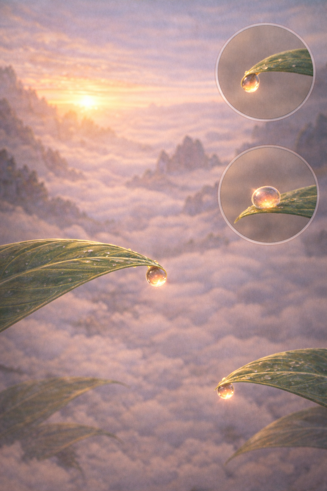
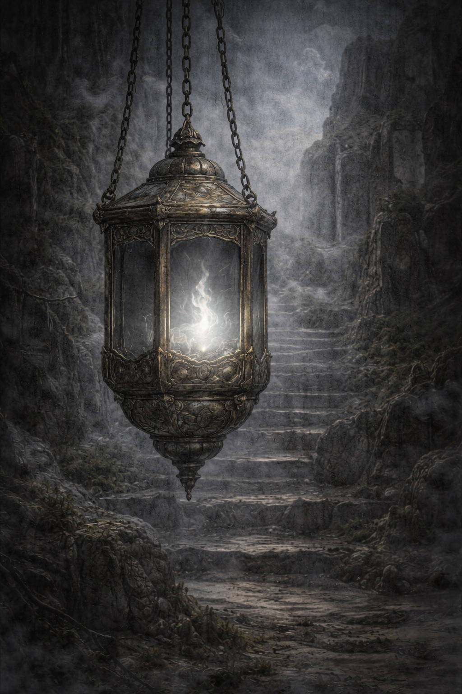

# 金丹期宝物

## 目录
- [丹霞玉露](#danxiayulu)
- [返照玄灯](#fanzhaoxuandeng)

本文件收录适合金丹阶段修士争夺、炼化或重点使用的宝物。  
这一层次的宝物，通常已经不再只是“补一点灵力”或“临时顶一顶”的外物，  
而会直接影响：

- 金丹品质
- 丹气稳固程度
- 后续修行上限
- 本命之路的定型
- 宗门对核心弟子的培养方式

因此，金丹期宝物往往既有个人机缘意义，  
也常常具备明显的宗门资源意义。

## 丹霞玉露

### 名称
丹霞玉露

### 基本类型
天然宝物

### 核心作用
以养丹、润丹、固丹为主，可洗炼金丹杂滓、缓和丹气躁性、稳固突破后的丹体状态，也可小幅提升金丹修士后续修行的圆融程度。

### 特殊属性
无

### 大致品级
地阶下品

### 条目资产目录
`./assets/金丹期宝物/`

### 适配对象
最适合金丹初成、金丹受损、丹气浮躁，或准备进一步打磨金丹品质的修士。  
尤其适合修行路数较正、重根基、重后劲，而非单纯追求一时爆发的人。

### 限制与代价
丹霞玉露长于“养”而不长于“催”。  
它不能代替破境，也不能平空拔高修为。  
若修士根基本就严重失衡、金丹已近崩裂，或所修路数过于刚猛偏激，则其效果会明显下降。  
此外，丹霞玉露一经启封，灵性流失很快，必须尽快炼化或妥善封存。

### 来历或背景
丹霞玉露常生于高阶灵山之巅、古老云海之上，需在大日将出未出、霞气最盛而露意未散之时方有可能凝成。  
其生成条件极为苛刻，不仅要有充沛灵机，还需天地气象、山势朝向与灵脉流转恰好契合。  
因此，丹霞玉露虽不以杀伐闻名，却一直是各大宗门、丹师与高阶修士极重视的金丹期奇物之一。

### 当前状态
暂留空

### 当前归属
暂留空

### 别称
霞露、养丹露

### 外观特征
其形多为指尖至拇指大小的露珠，色泽并非纯赤，而是外清内暖，中心隐带一缕淡金或丹红霞意。  
静置时如玉珠凝露，轻轻摇晃时，其内霞光会随之流转，如晨曦未散。  
若以神识细察，可感到其灵机温润绵长，不烈不躁，自有一种“养而不争”的气象。

### 概念图说明
当前示意图强调的是丹霞玉露“温养金丹”的灵物气质。  
视觉重点不在夸张异象，而在露珠本身的温润、霞意流转与可被封存取用的珍贵感。

### 认主情况
通常不涉及认主。  
丹霞玉露更接近高层级天地奇物，而不是可长期认主温养的器物型宝物。

### 温养情况
可短期封存温养，但不宜久拖。  
若封存手段足够高明，可稍稍维持其灵性与霞意；  
但总体而言，丹霞玉露最适合在取得后较短时间内使用。

### 与组织或传承的关系
大宗门往往会将丹霞玉露视作重要储备，用于：

- 奖赐新成金丹的核心弟子
- 稳固宗门高层新成金丹
- 修补某些关键修士的丹体暗伤
- 作为高阶炼丹、医养体系中的珍贵辅材

因此，它虽不是战略重宝，却常具明显的组织级价值。

在宗门的核心弟子培养体系中，丹霞玉露尤其重要。  
许多宗门并不会把它随意发放给所有金丹修士，  
而是更倾向于将其投入那些：

- 金丹品质本就上乘、值得继续打磨的人
- 身兼重任、未来有望冲击更高层次的人
- 突破后留下暗损、但仍有大好前程的人
- 作为某一脉嫡系、需要稳住根基的人

也就是说，丹霞玉露常常不仅是“灵物”，  
也是宗门筛选、扶持与保全核心金丹战力的重要资源。

同时，它与医养体系的联系很深。  
在高明医者手中，丹霞玉露并不只是直接服用之物，  
还可被用于：

- 温养丹体
- 缓和丹裂后的躁动灵机
- 配合针、药、阵法慢慢修复丹伤
- 作为某些养丹、护丹、续丹类方案中的关键一环

因此，丹霞玉露的价值并不止于“谁拿到谁吃”，  
而往往要放入更完整的医养与培养体系中，才能真正发挥出来。

### 特殊使用条件
最常见的用法有三种：

- 直接炼化，用于养丹、稳丹
- 配合丹药与医养手段，用于修补丹体暗损
- 作为高阶丹方中的关键辅材，提升某些养丹、润丹类丹药的上限

但无论哪种方式，通常都要求使用者至少具备稳定金丹，或有足够高明的外力辅助。

### 已知弱点 / 克制方式
其最大弱点在于用途偏窄。  
对真正走极锋、极烈、极险之路的修士来说，丹霞玉露往往不是最优先的奇物。  
此外，若遭污秽、邪火、浊煞侵染，其温润中和之性会大幅受损，价值也会明显下降。

### 衍生影响
服用丹霞玉露后，修士往往会在一段时间内：

- 丹气更稳
- 行功更顺
- 不易躁进
- 对自身金丹状态的把握更细

因此，它不仅是一种“养丹奇物”，  
也常常会让修士的斗法风格与修行节奏暂时转向更稳、更细、更耐久的一侧。

### 关键变化记录
暂留空

## 返照玄灯

### 名称
返照玄灯

### 基本类型
异宝

### 核心作用
以“返照”为本，能映出修士金丹、神通、法力运转中的细微瑕疵与失衡之处；  
平时可用于校正修行、稳固神通，斗法时则可短暂照见对手术法破绽与气机转折。

### 特殊属性
无

### 大致品级
地阶中品

### 条目资产目录
`./assets/金丹期宝物/`

### 适配对象
最适合金丹中期上下、已经开始打磨神通结构、重视法力精细运转与斗法节奏控制的修士。  
尤其适合：

- 神识较强者
- 走稳健、精细、控制路线的人
- 重视术法结构、阵法、镜法、幻法、医养诊察的人

### 限制与代价
返照玄灯最忌被当作“万能照妖镜”使用。  
它能照见破绽，但不等于能替使用者解决破绽。  
若修士本身悟性不足、心性不稳，久观玄灯，反而可能陷入：

- 反复自疑
- 过度求全
- 行功迟滞
- 对自身破绽的病态执着

斗法中强行久照，也会显著消耗心神与神识。  
因此，它长于“见微”，不长于“强压”。

### 来历或背景
返照玄灯并非人为炼成之灯，而是某些极少数洞天裂隙、古殿遗址或灵机回涌之地，在光影、雾气、残留法意长期沉积后自然形成的异宝。  
它外形似灯，却往往无芯无油，自生一缕微光。  
真正珍贵之处不在灯形，而在其所具备的“返照之性”：  
能令被照之物不先显其强，而先显其隙。

因此，它从一开始就不是“材料”，  
而是一件已经成立的特殊对象。

### 当前状态
暂留空

### 当前归属
暂留空

### 别称
照隙灯、见瑕灯

### 外观特征
多呈古灯模样，体色偏黯，材质近金非金、近玉非玉，表面常有极浅的晦光纹路。  
点亮时并非大放光明，而只生一缕清冷微光，似明非明，似雾非雾。  
其光不耀眼，却极耐看；若久视灯焰，会隐隐生出“被反照”的异样感，仿佛并非自己在看灯，而是灯在看自己。

### 概念图说明
当前示意图突出的是返照玄灯“见隙而不炫光”的异宝感。  
整体应偏古朴、内敛，灯火不张扬，却带有一种能照见瑕隙与自我反观的冷静意味。

### 认主情况
可认主，但认主深度通常有限。  
返照玄灯更重“相性”而非死契。  
它会更偏向那些心神较定、愿意直视自身缺陷的人；  
对急躁、浮华、只求速胜之人，往往回应较浅，甚至显得格外晦暗难用。

### 温养情况
可长期温养。  
温养越久，灯光越稳，照见之力越细。  
但其根本功能不会因此发生本质改变：  
它始终重在“照见”，而不在“增幅”。

### 与组织或传承的关系
返照玄灯虽非战略重宝，却很受大宗门、阵师、医者与某些讲究法统精细传承的支脉重视。  
在一些大宗门中，它会被用作：

- 核心弟子修行校正之宝
- 高阶医养中的辅诊之物
- 阵师、镜修、幻法修士的专门异宝
- 关键弟子破境前后的“照隙”辅助之器

因此，它常常不是靠“正面杀伤”出名，  
而是靠“谁真懂它，谁就离大错更远一步”而被重视。

### 特殊使用条件
最常见的使用方式有三种：

- 静室观灯：照自身金丹、神通、气机运转中的细隙  
- 行功照灯：在运功过程中借灯光校正偏差  
- 斗法映照：短时照见对手术法与气机的破绽，但消耗较大

它不依赖被进一步加工才显出价值，  
取之即用。  
但越高明的使用者，越能真正发挥其“返照”之妙。

### 已知弱点 / 克制方式
返照玄灯的弱点不在于脆，而在于偏。  
它偏于照见、偏于细察、偏于揭隙。  
因此面对：

- 一味蛮横的重击压制
- 神识遮断
- 强行扰乱光感与感知的手段
- 故意制造大量假破绽的诡术

其效果都会下降。  
此外，若使用者自身心神已乱，则玄灯往往照得越多，乱得越快。

### 衍生影响
返照玄灯会明显改变持有者的修行与斗法风格。  
久用此灯者，往往会变得：

- 更谨慎
- 更重结构
- 更重细节
- 更擅长找破绽
- 但也更容易变得过于求稳、过于苛察

因此，它既可能成就高明修士，  
也可能把心性不足者推向迟疑与自困。

### 关键变化记录
暂留空
